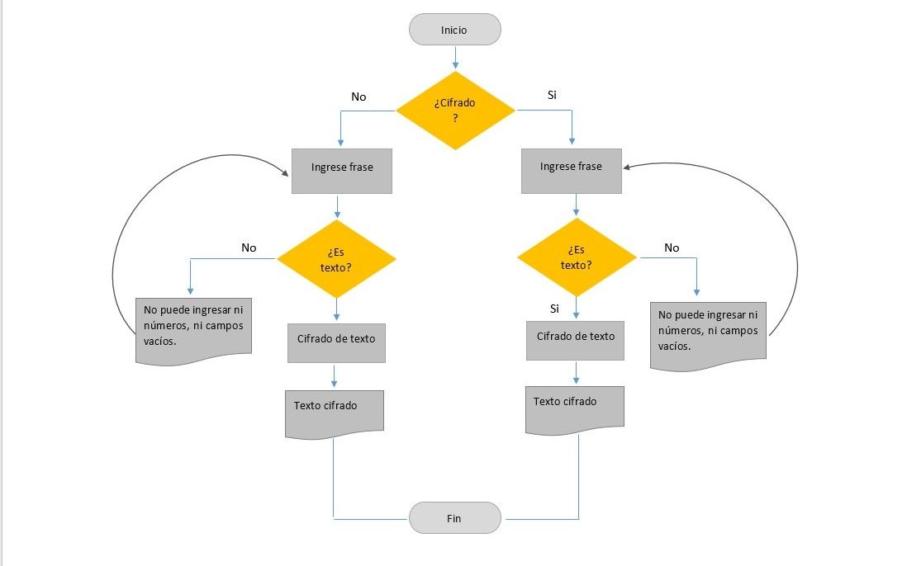

Programa de Cifrado César
===================

Este programa muestra al usuario final las opciones de cifrado y descifrado mediante un PROMPT() y apartir de lo escogidoencripta el mensaje insertado por el usuario. Asimismo tiene la opción descifrar los mensajes encriptados en el mismo código.

Este README contiene : 

 - Pseudocódigo

 - Diagrama de flujo

----------

Pseudocódigo
-------------

1. INICIO
2. Se crea una funcion principal llamada headDirector que  mostrará las opciones de cifrar o descifrar y evaluará que     ingrese uno de las opciones establecidas.
3. De ingresarse la opción 1, se deriva a la funcion Cipher
4. Se pedirá la frase a cifrar y se evaluará que sea un texto
5. De ser un  texto se pasa a cifrar
7. Se devuelve mediante un alert() la frase cifrada
6. De no validarse el texto, se le vuelve a pedir que ingrese una frase que no sea un campo vacio o número.
7. De ingresarse la opción 2, se deriva a la funcion Decipher
8. Se pedirá la frase a descifrar y se evaluará que sea un texto
9. De ser un texto se pasa a descifrar
10. De devuelve mediante un alert() la frase descifrada
10. De no validarse el texto, se le vuelve a pedir que ingrese una frase que no sea un campo vacio o número.
14. FIN

---------
Diagrama de flujo
-------------

